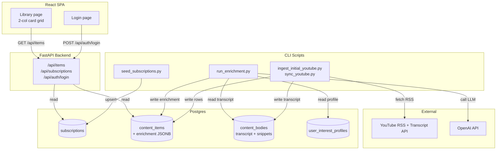

# Architecture

Technical design for Knowledge-OS ingest, processing, API, and frontend. Product goals live in [north-star.md](north-star.md).

---

## System flow



---

## Domain model

Three core concepts:

| Concept          | Meaning                       | Example                               |
| ---------------- | ----------------------------- | ------------------------------------- |
| **Subscription** | A feed you follow             | Fireship on YouTube, Lenny's Substack |
| **Content item** | One thing that feed published | A video, an article                   |
| **Body**         | Raw text for that item        | Transcript (with snippets), markdown  |

**Platform** (YouTube, Substack) is not a separate entity. It is `subscriptions.kind`, which selects which adapter and job logic to run.

**Content type** (video, article) is `content_items.kind`.

All content types share one library. Filter by subscription kind or content kind in the UI.

---

## Database

### Tables

```
subscriptions
  └── content_items  (1:N)
        ├── content_bodies    (1:1 per body_kind)
        └── content_artifacts (1:1, for deep processing later)
```

#### `subscriptions`

A channel, newsletter, or RSS feed you subscribe to.

| Column                     | Type        | Notes                                                   |
| -------------------------- | ----------- | ------------------------------------------------------- |
| `id`                       | UUID        | PK                                                      |
| `kind`                     | enum        | Platform adapter: `youtube_channel`, `substack` (later) |
| `external_id`              | string      | Channel ID, Substack slug, etc. Unique globally         |
| `title`                    | string      | Filled by enrich step                                   |
| `url`                      | string      | Channel or publication URL                              |
| `is_active`                | bool        | Inactive subscriptions are skipped by sync              |
| `last_synced_at`           | timestamptz | Set after a successful sync job                         |
| `created_at`, `updated_at` | timestamptz |                                                         |

#### `content_items`

Metadata for one published video or article.

| Column                     | Type        | Notes                                                       |
| -------------------------- | ----------- | ----------------------------------------------------------- |
| `id`                       | UUID        | PK                                                          |
| `subscription_id`          | UUID        | FK → `subscriptions.id`                                     |
| `external_id`              | string      | Video ID or article slug. Unique per subscription           |
| `kind`                     | enum        | `video`, `article` (later)                                  |
| `title`                    | string      |                                                             |
| `description`              | string      | Nullable                                                    |
| `url`                      | string      |                                                             |
| `thumbnail_url`            | string      | Nullable for articles                                       |
| `author`                   | string      | Channel name or newsletter author                           |
| `published_at`             | timestamptz | Indexed                                                     |
| `body_status`              | enum        | `pending`, `available`, `unavailable`                       |
| `processing_status`        | enum        | `ingested` for now; `kept` etc. later                       |
| `user_status`              | enum        | `unread` (default), `interested`, `dismissed`               |
| `enrichment`               | JSONB       | Nullable. AI blurb, tags, relevance score (see shape below) |
| `created_at`, `updated_at` | timestamptz |                                                             |

Unique constraint: `(subscription_id, external_id)`.

`enrichment` JSONB shape (written by enrichment job, read by API):

```json
{
  "blurb": "...",
  "tags": ["..."],
  "content_type": "tutorial",
  "domain_matches": ["ai", "swe"],
  "relevance_score": 0.8,
  "input_kind": "full",
  "profile_version": 1,
  "model": "gpt-...",
  "enriched_at": "2026-06-25T12:00:00Z"
}
```

#### `content_bodies`

Raw body text, stored separately so metadata and payload can evolve independently.

| Column                     | Type        | Notes                                                |
| -------------------------- | ----------- | ---------------------------------------------------- |
| `id`                       | UUID        | PK                                                   |
| `content_item_id`          | UUID        | FK → `content_items.id`                              |
| `body_kind`                | enum        | `transcript`, `markdown` (later)                     |
| `language_code`            | string      | Nullable                                             |
| `is_generated`             | bool        | Nullable; relevant for auto-generated transcripts    |
| `text`                     | text        | Full plain text                                      |
| `snippets`                 | JSONB       | Timestamped segments; transcripts only               |
| `error`                    | text        | Last fetch error when `body_status` is `unavailable` |
| `fetched_at`               | timestamptz |                                                      |
| `created_at`, `updated_at` | timestamptz |                                                      |

Unique constraint: `(content_item_id, body_kind)`.

#### `content_artifacts`

Reserved for deep-processed output (timestamped outline, chapter summaries). Written only after a user marks an item as `interested` (Tier 2, not yet built).

| Column             | Type        | Notes                     |
| ------------------ | ----------- | ------------------------- |
| `id`               | UUID        | PK                        |
| `content_item_id`  | UUID        | FK → `content_items.id`   |
| `summary`          | text        | Nullable                  |
| `chapters`         | JSONB       | Nullable                  |
| `model`            | string      | Model used                |
| `generated_at`     | timestamptz |                           |
| `created_at`, `updated_at` | timestamptz |                  |

#### `user_interest_profiles`

Single-row table. Stores interest weights, context prose, and per-channel notes used by the enrichment job.

| Column           | Type        | Notes                                                        |
| ---------------- | ----------- | ------------------------------------------------------------ |
| `id`             | UUID        | PK                                                           |
| `version`        | int         | Bumped when weights/prose change; enrichment detects stale rows |
| `domain_weights` | JSONB       | `{ "ai": 1.0, "swe": 0.8, ... }`                            |
| `context_prose`  | text        | Nullable. Free-text description of interests                 |
| `channel_notes`  | JSONB       | Nullable. Per-channel boost/deprioritize hints               |
| `created_at`, `updated_at` | timestamptz |                                                |

### Enums

| Enum               | Values (now)                          | Values (later)  |
| ------------------ | ------------------------------------- | --------------- |
| `SubscriptionKind` | `youtube_channel`                     | `substack`      |
| `ContentKind`      | `video`                               | `article`       |
| `BodyKind`         | `transcript`                          | `markdown`      |
| `BodyStatus`       | `pending`, `available`, `unavailable` |                 |
| `ProcessingStatus` | `ingested`                            | `kept`, etc.    |
| `UserStatus`       | `unread`, `interested`, `dismissed`   |                 |

### Migrations

Applied in order:

| Revision | Description |
| -------- | ----------- |
| `b53116d551c5` | Initial schema (`sources` naming) |
| `c8a2f1e94b3d` | Rename `sources` → `subscriptions` |
| `5ccd309c2a94` | Add digest schema: `user_status`, `enrichment`, `user_interest_profiles` |
| `529159d4d546` | Add `content_artifacts` table |

Run from `backend/`:

```bash
uv run alembic upgrade head
```

---

## Ingest pipeline

Ingest fetches external data and writes it to the three core tables. It does not run digest, chunking, embeddings, or chat (see north-star tiers 2+).

### Layered layout

```text
app/ingest/
├── adapters/          # Internet → plain Python objects. No database imports.
│   └── youtube.py
├── operations/        # Database operations. No HTTP. Thin read/write helpers.
│   ├── subscriptions.py
│   └── content.py
├── jobs/              # Ingest tasks. Wires adapters + operations + commits.
│   ├── upsert_subscription.py
│   ├── sync_subscription.py
│   └── sync_all.py
└── runner.py          # Entrypoints for scripts.
```

| Layer         | Responsibility                          | Example                                              |
| ------------- | --------------------------------------- | ---------------------------------------------------- |
| **Adapter**   | Fetch from an external platform         | RSS feed, transcript API                             |
| **Operation** | Read/write database rows                | `ensure_subscription`, `save_body`                   |
| **Job**       | Complete ingest task                    | Register subscription, sync one feed, sync all feeds |
| **Runner**    | Invoke jobs with config from `settings` | `run_sync()`, `run_initial_ingest()`                 |

### Layer rules

- Adapters never import SQLAlchemy.
- Operations never import feedparser, httpx for ingest, or platform SDKs.
- Jobs own transaction boundaries and orchestration.
- Scripts and API routes call runner or jobs; they contain no business logic.

### Data flow: register a subscription

```text
seed_subscriptions.py
  → jobs/upsert_subscription.py
      → operations/subscriptions.py     ensure row exists
      → adapters/youtube.py             fetch title + URL from RSS
      → operations/subscriptions.py     update metadata
      → commit
```

### Data flow: sync content

```text
sync_youtube.py
  → runner.run_sync()
    → jobs/sync_all.py
      → jobs/sync_subscription.py         per subscription
          → adapters/youtube.py           list items in time window
          → operations/content.py         ensure content_item rows
          → adapters/youtube.py           fetch transcript when needed
          → operations/content.py         save body, set body_status
          → operations/subscriptions.py   set last_synced_at
          → commit (one commit per subscription)
  → runner.run_enrichment()
      → processing/jobs/enrich_items.py   enrich items without a blurb
```

### Idempotency

| Case                                              | Action                                                         |
| ------------------------------------------------- | -------------------------------------------------------------- |
| Content item not in DB                            | Insert item, fetch body                                        |
| Item exists, `body_status` available              | Skip body fetch                                                |
| Item exists, `body_status` pending or unavailable | Retry body fetch                                               |
| Body fetch fails                                  | Store error on `content_bodies`, set `body_status` unavailable |
| Re-run sync                                       | No duplicate rows (`subscription_id` + `external_id` unique)   |

Initial ingest and recurring sync use the **same job** with different time windows from config (`ingest_initial_window_hours` vs `ingest_sync_window_hours`).

### RSS constraint

YouTube channel sync uses RSS (`feeds/videos.xml`). RSS returns roughly the **15 most recent** entries per channel. A larger initial time window filters those entries; it does not backfill older history. Accept this for MVP.

---

## Processing pipeline

Enriches each ingested item with a digest blurb, tags, and relevance score using a cheap LLM call.

```text
app/processing/
├── digest.py              # Prompt construction + OpenAI call
├── sampling.py            # Transcript excerpt logic (first ~15 min)
├── operations/
│   └── enrichment.py      # DB queries: items needing enrichment, save payload
├── jobs/
│   └── enrich_items.py    # Iterates items, calls digest, saves, commits per-item
└── runner.py              # run_enrichment() entrypoint
```

Enrichment is idempotent: re-runs skip items where `enrichment IS NOT NULL` and `profile_version` matches the current interest profile version.

---

## API layer

FastAPI routes served from `app/main.py`. All data routes are under `/api` so Caddy can reverse-proxy with a single prefix rule in production.

```text
app/api/
├── auth.py           # bcrypt verify, JWT issue/validate, get_current_user dependency
├── deps.py           # get_db async session dependency
├── schemas.py        # Pydantic response models
└── routes/
    ├── auth.py       # POST /api/auth/login
    ├── items.py      # GET /api/items
    └── subscriptions.py  # GET /api/subscriptions
```

### Auth

Single-user. Credentials live in `backend/.env`:

- `AUTH_USERNAME` — plain text username
- `AUTH_PASSWORD_HASH` — bcrypt hash (generate with `scripts/hash_password.py`)
- `JWT_SECRET` — signing key (at least 32 chars)
- `JWT_EXPIRE_MINUTES` — default 10 080 (7 days)

All `/api` routes except `/api/auth/login` and `/health` require `Authorization: Bearer <token>`.

### Endpoints

| Method | Path                  | Auth | Description                                              |
| ------ | --------------------- | ---- | -------------------------------------------------------- |
| `GET`  | `/health`             | No   | Health check                                             |
| `GET`  | `/api/health`         | No   | Health check (API-prefixed alias)                        |
| `POST` | `/api/auth/login`     | No   | `{ username, password }` → `{ access_token, token_type }` |
| `GET`  | `/api/items`          | Yes  | Paginated content library (see params below)             |
| `GET`  | `/api/subscriptions`  | Yes  | Active subscriptions ordered by title                    |

`GET /api/items` query params:

| Param             | Default         | Notes                                            |
| ----------------- | --------------- | ------------------------------------------------ |
| `window_hours`    | `168`           | Items published in last N hours                  |
| `all_time`        | `false`         | Ignore `window_hours`, return all                |
| `sort`            | `chronological` | `ORDER BY published_at DESC`                     |
| `status`          | `all`           | Filter by `user_status`                          |
| `subscription_id` | —               | Filter to one channel                            |
| `limit`           | `50`            | Max 200                                          |
| `offset`          | `0`             |                                                  |

### DB sessions

`app/database/session.py` exposes two session factories:

- `get_session()` — sync context manager, used by CLI scripts
- `get_async_session()` — async context manager, used by FastAPI route handlers via `app/api/deps.py`

Both connect to the same Postgres database. Scripts stay sync; API routes use async.

---

## Configuration

All settings live in `app/config.py` and are loaded from `backend/.env`.

| Setting                       | Purpose                                        |
| ----------------------------- | ---------------------------------------------- |
| `POSTGRES_*`                  | Database connection                            |
| `OPENAI_API_KEY`              | Required for enrichment only                   |
| `OPENAI_SIMPLE_MODEL`         | Model used for enrichment blurbs (cheap)       |
| `OPENAI_MODEL`                | Model for future deep processing               |
| `INGEST_INITIAL_WINDOW_HOURS` | First ingest window (default 336)              |
| `INGEST_SYNC_WINDOW_HOURS`    | Recurring sync window (default 168)            |
| `INGEST_SUBSCRIPTION_ID`      | Optional: sync one subscription only           |
| `TRANSCRIPT_LANGUAGES`        | Preferred transcript languages                 |
| `EXCLUDE_SHORTS`              | Skip YouTube Shorts in RSS                     |
| `ENRICHMENT_TRANSCRIPT_MAX_SECONDS` | Transcript excerpt length limit         |
| `ENRICHMENT_WINDOW_HOURS`     | Optional: only enrich items in last N hours    |
| `ALLOWED_ORIGINS`             | CORS origins (comma-separated)                 |
| `AUTH_USERNAME`               | Login username                                 |
| `AUTH_PASSWORD_HASH`          | bcrypt hash of login password                  |
| `JWT_SECRET`                  | JWT signing key (required)                     |
| `JWT_EXPIRE_MINUTES`          | Token TTL (default 10 080 = 7 days)            |
| `AUTH_COOKIE_SECURE`          | Set `true` in production (HTTPS only)          |

---

## Scripts (dev entrypoints)

```text
scripts/
  seed_subscriptions.py       # Read data/input/subscriptions.json → upsert_subscription job
  ingest_initial_youtube.py   # runner.run_initial_ingest()
  sync_youtube.py             # runner.run_sync() then runner.run_enrichment()
  run_enrichment.py           # runner.run_enrichment() standalone (full backfill)
  seed_interest_profile.py    # Seed user_interest_profiles table from hardcoded defaults
  hash_password.py            # Print bcrypt hash of a given password for use in .env
  probe_youtube_channel.py    # Debug adapter only; no database
  probe_digest.py             # Debug enrichment output for one item; no writes
```

Example operator flow (first run):

```bash
uv run python scripts/seed_subscriptions.py
uv run python scripts/seed_interest_profile.py
uv run python scripts/ingest_initial_youtube.py
uv run python scripts/sync_youtube.py        # also enriches
```

---

## `app/` layout (current)

```text
app/
├── config.py
├── main.py                         # FastAPI app, CORS, router registration
├── database/
│   ├── base.py
│   ├── session.py                  # Sync + async session factories
│   └── models/
│       ├── subscription.py
│       ├── content_item.py
│       ├── content_body.py
│       ├── content_artifact.py
│       ├── user_interest_profile.py
│       └── enums.py
├── ingest/
│   ├── adapters/youtube.py
│   ├── operations/
│   │   ├── subscriptions.py
│   │   └── content.py
│   ├── jobs/
│   │   ├── upsert_subscription.py
│   │   ├── sync_subscription.py
│   │   └── sync_all.py
│   └── runner.py
├── processing/
│   ├── digest.py
│   ├── sampling.py
│   ├── operations/enrichment.py
│   ├── jobs/enrich_items.py
│   └── runner.py
├── api/
│   ├── auth.py
│   ├── deps.py
│   ├── schemas.py
│   └── routes/
│       ├── auth.py
│       ├── items.py
│       └── subscriptions.py
├── agents/                         # OpenAI client wrapper used by processing
│   ├── client.py
│   ├── factory.py
│   └── openai.py
└── retrieval/                      # not built — search + chat (north-star tier 3)
```

---

## Frontend layout (current)

```text
frontend/src/
├── App.tsx                         # Router, AuthProvider
├── main.tsx
├── hooks/
│   └── use-auth.ts                 # useAuth() hook
├── lib/
│   ├── api.ts                      # fetch wrapper, login(), fetchItems()
│   ├── auth.tsx                    # AuthProvider component
│   ├── auth-context.ts             # AuthContext definition
│   ├── env.ts                      # VITE_API_BASE_URL
│   ├── types.ts                    # ContentItem, PaginatedItems, etc.
│   └── utils.ts                    # cn() tailwind helper
├── components/
│   ├── ContentCard.tsx
│   ├── ProtectedRoute.tsx
│   └── ui/                         # shadcn components
│       ├── badge.tsx
│       ├── button.tsx
│       ├── card.tsx
│       ├── input.tsx
│       ├── label.tsx
│       └── select.tsx
└── pages/
    ├── LoginPage.tsx               # /login
    └── LibraryPage.tsx             # /library (protected)
```

Vite dev server (`localhost:5173`) proxies `/api/*` to `localhost:8000`.

---

## Extending to new platforms

Add one adapter file and one branch in `jobs/sync_subscription.py`:

```text
ingest/adapters/substack.py     # RSS or scrape → ContentItemDraft + BodyDraft (markdown)
```

`operations/content.py` stays unchanged. `subscriptions.kind` selects the adapter.

---

## Relationship to north-star

| North-star step                     | Architecture component               | Status         |
| ----------------------------------- | ------------------------------------ | -------------- |
| Ingest channel videos + transcripts | `ingest/` jobs and operations        | Done           |
| Digest blurb + tags                 | `processing/`                        | Done           |
| Library UI                          | `api/` + frontend `/library`         | Done           |
| Weekly digest UI                    | filter on `user_status` + time range | Not built      |
| Deep processing on kept items       | `processing/` + `content_artifacts`  | Schema only    |
| Chat with citations                 | `retrieval/` (not built)             | Not built      |

---

## Current implementation status

| Area                               | Status                                          |
| ---------------------------------- | ----------------------------------------------- |
| DB schema + migrations             | Done (4 migrations applied)                     |
| YouTube adapter (RSS + transcripts)| Done (`ingest/adapters/youtube.py`)             |
| Subscription upsert + sync jobs    | Done (`ingest/jobs/`)                           |
| Enrichment pipeline                | Done (`processing/`)                            |
| FastAPI API (`/api/items`, auth)   | Done (`api/`)                                   |
| Login + content library UI         | Done (React SPA, `pages/LoginPage`, `LibraryPage`) |
| Weekly digest surface              | Not built                                       |
| Deep processing (Tier 2)           | Not built                                       |
| Chat (Tier 3)                      | Not built                                       |
